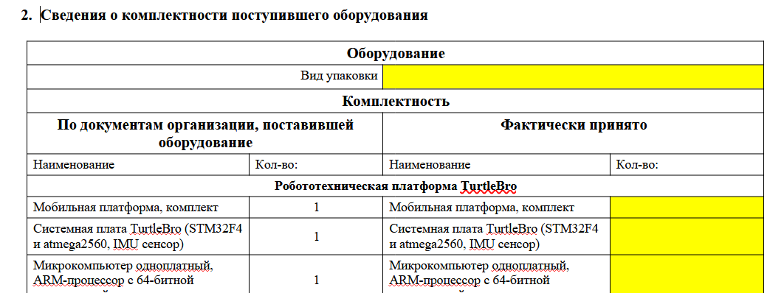
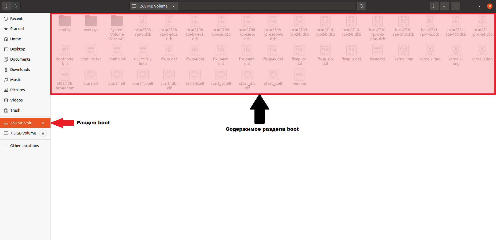

Общий алгоритм выполнения задания А на чемпионате:

1. Принять комплект с роботом, распаковать. Заполнить "Сведения о комплектности" в "Акте о приеме оборудования. Понять, чего не хватает. Заполнить "Заявку на доукомплектование" и отдать эксперту в обмен на то, чего собственно не хватает

2. Достать sd карту из робота и вставить в компьютер. Настроить подключение к сети и имя робота

3. Вернуть sd карту в робота, включить его. Убедиться, что робот подключился к сети и имя изменилось. Для удобства питать робота от батареек, а не блока питания.

4. Заполнить все остальные разделы "Акта о приеме"

5. Собрать навесное оборудование

6. Заполнить все поля "Инструкции"

7. Продемонстрировать экспертам заполнение раздела о работоспособности в файле "Инструкция"

8. Готово.

## **А1. Прием робототехнического комплекта**

В начале работы Конкурсант получает у организаторов упаковку с роботом и комплект расширения «Робот-курьер». Для приемки робота необходимо выполнить следующие действия:

### [highlight:lemon-yellow]***\> Распаковать робота и комплект расширения и проверить комплектацию;***[/highlight]

А так же **Заполнить соответствующие разделы акта о приёме оборудования. В случае неполной комплектации в текстовом редакторе заполнить запрос на доукомплектование, используя форму Запроса на доукомплектование, и продемонстрировать этот запрос техническому эксперту;**

Все, что написано в документе "Акт о приеме оборудования" (таблица #2) должно быть в комплекте поставки. Внимательно проверьте и посчитайте все, и только после этого ставьте отметку о наличии

{width=1062px height=398px}


:::note 

**Обратите внимание на форматирование файла: желтый цвет надо везде убрать! Шрифт, выравнивание должны быть как в остальных ячейках.**

:::

Максимум за таблицу №2 и шапку документа+конец документа можно получить 2 балла. Оценка ставится так:

-  0% если Акт не заполнен или не заполненных ячеек больше 5 шт.

-  30% В акте не заполнены менее 5-ти ячеек. Документ оформлен не качественно (ячейки имеют желтый цвет; не подходящий тип или размер шрифта и т.д.). Заключение приемщика не написано или написано не аргументировано

-  60% В акте заполнены все ячейки. Документ оформлен не качественно (не более 5-ти ячеек) (ячейки имеют желтый цвет; не подходящий тип или размер шрифта и т.д.). Написано аргументированное заключение приёмщика

-  В акте заполнены все ячейки. Правильно подобран тип и размер шрифта. Написано аргументированное заключение приёмщика

### [highlight:lemon-yellow]***\> Настроить подключение робота к сети полигона;***[/highlight]

Изначально робот не подключен к сети. Вам будет выдан SSID и пароль от wifi сети.

**Способ подключения через SD карту:**

{width=1846px height=894px}


Если на этапе загрузки Raspberry найдет файл `wpa_supplicant.conf` в **разделе** `boot` то этот файл будет перемещен в **раздел** `system`, а именно в `/etc/wpa_supplicant/wpa_supplicant.conf` и таким образом станет конфигурационным файлом подключения к Wi-Fi сетям.

Чтобы сконфигурировать Raspberry Pi в этом режиме необходимо:

-  Подключите microSD карту Raspberry к вашему компьютеру с помощью карт-ридера

-  Откройте **раздел** `boot` и создайте файл `wpa_supplicant.conf`:

```bash
touch wpa_supplicant.conf
```

-  Откройте текстовый редактор и добавьте в этот файл следующее содержание:

```
ctrl_interface=DIR=/var/run/wpa_supplicant GROUP=netdev
update_config=1
country=US

network={
    ssid="WIFI_NETWORK_NAME"
    psk="wifipassword"
}
```

`WIFI_NETWORK_NAME` и `wifipassword` замените на выданные вам параметры сети. Использование кавычек `"` в файле с настройками обязательно!

-  Сохраните файл (CTRL + S)

-  Установите microSD карту в Raspberry и дождитесь завершения загрузки.

### [highlight:lemon-yellow]***\> Настроить имя хоста робота на имя вида turtlebroXX, где XX номер, написанный на наклейке робота;***[/highlight]

1) Вставить SD карту в кардридер и в ноутбук

2) Открыть в проводнике раздел System, который занимает основной объем microSD карты (в системе может называться 7,5 Gb)

{width=138px height=355px}

{width=1113px height=341px}


3) Перейти в папку /etc и открыть в ней терминал: