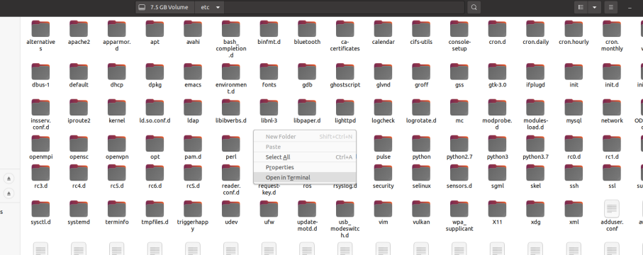
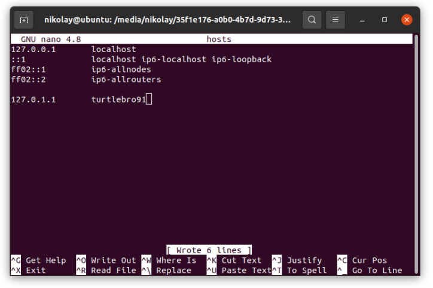
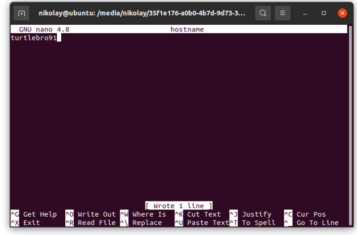
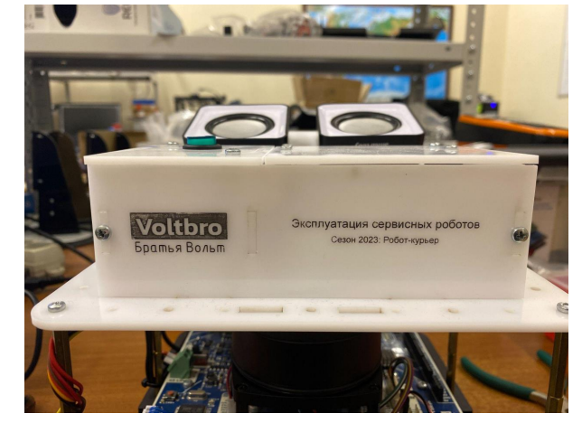
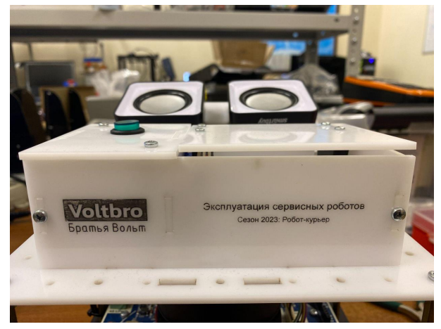

Общий алгоритм выполнения задания А на чемпионате:

1. Принять комплект с роботом, распаковать. Заполнить "Сведения о комплектности" в "Акте о приеме оборудования. Понять, чего не хватает. Заполнить "Заявку на доукомплектование" и отдать эксперту в обмен на то, чего собственно не хватает

2. Достать sd карту из робота и вставить в компьютер. Настроить подключение к сети и имя робота

3. Вернуть sd карту в робота, включить его. Убедиться, что робот подключился к сети и имя изменилось. Для удобства питать робота от батареек, а не блока питания.

4. Заполнить все остальные разделы "Акта о приеме"

5. Собрать навесное оборудование

6. Заполнить все поля "Инструкции"

7. Продемонстрировать экспертам заполнение раздела о работоспособности в файле "Инструкция"

8. Готово.

## **А1. Прием робототехнического комплекта**

В начале работы Конкурсант получает у организаторов упаковку с роботом и комплект расширения «Робот-курьер». Для приемки робота необходимо выполнить следующие действия:

### [highlight:lemon-yellow]***\> Распаковать робота и комплект расширения и проверить комплектацию;***[/highlight]

А так же **Заполнить соответствующие разделы акта о приёме оборудования. В случае неполной комплектации в текстовом редакторе заполнить запрос на доукомплектование, используя форму Запроса на доукомплектование, и продемонстрировать этот запрос техническому эксперту;**

Все, что написано в документе "Акт о приеме оборудования" (таблица #2) должно быть в комплекте поставки. Внимательно проверьте и посчитайте все, и только после этого ставьте отметку о наличии

{width=1062px height=398px}


:::note 

**Обратите внимание на форматирование файла: желтый цвет надо везде убрать! Шрифт, выравнивание должны быть как в остальных ячейках.**

:::

Максимум за таблицу №2 и шапку документа+конец документа можно получить 2 балла. Оценка ставится так:

-  0% если Акт не заполнен или не заполненных ячеек больше 5 шт.

-  30% В акте не заполнены менее 5-ти ячеек. Документ оформлен не качественно (ячейки имеют желтый цвет; не подходящий тип или размер шрифта и т.д.). Заключение приемщика не написано или написано не аргументировано

-  60% В акте заполнены все ячейки. Документ оформлен не качественно (не более 5-ти ячеек) (ячейки имеют желтый цвет; не подходящий тип или размер шрифта и т.д.). Написано аргументированное заключение приёмщика

-  В акте заполнены все ячейки. Правильно подобран тип и размер шрифта. Написано аргументированное заключение приёмщика

### [highlight:lemon-yellow]***\> Настроить подключение робота к сети полигона;***[/highlight]

Изначально робот не подключен к сети. Вам будет выдан SSID и пароль от wifi сети.

**Способ подключения через SD карту:**

{width=1846px height=894px}


Если на этапе загрузки Raspberry найдет файл `wpa_supplicant.conf` в **разделе** `boot` то этот файл будет перемещен в **раздел** `system`, а именно в `/etc/wpa_supplicant/wpa_supplicant.conf` и таким образом станет конфигурационным файлом подключения к Wi-Fi сетям.

Чтобы сконфигурировать Raspberry Pi в этом режиме необходимо:

-  Подключите microSD карту Raspberry к вашему компьютеру с помощью карт-ридера

-  Откройте **раздел** `boot` и создайте файл `wpa_supplicant.conf`:

```bash
touch wpa_supplicant.conf
```

-  Откройте текстовый редактор и добавьте в этот файл следующее содержание:

```
ctrl_interface=DIR=/var/run/wpa_supplicant GROUP=netdev
update_config=1
country=US

network={
    ssid="WIFI_NETWORK_NAME"
    psk="wifipassword"
}
```

`WIFI_NETWORK_NAME` и `wifipassword` замените на выданные вам параметры сети. Использование кавычек `"` в файле с настройками обязательно!

-  Сохраните файл (CTRL + S)

-  Установите microSD карту в Raspberry и дождитесь завершения загрузки.

### [highlight:lemon-yellow]***\> Настроить имя хоста робота на имя вида turtlebroXX, где XX номер, написанный на наклейке робота;***[/highlight]

1. Вставить SD карту в кардридер и в ноутбук

2. Открыть в проводнике раздел System, который занимает основной объем microSD карты (в системе может называться 7,5 Gb)

{width=138px height=355px}

{width=1113px height=341px}


1. Перейти в папку /etc и открыть в ней терминал:

{width=907px height=360px}


1. Открыть с помощью nano файл host и изменить его содержимое на нужное имя робота:

```bash
sudo nano host
```

Внутри файла изменить название (в конце под ip 127.0.0.1):

{width=724px height=481px}

1. Открыть аналогично файл hostname и так же изменить имя робота в нем:

```
sudo nano hostname
```

{width=722px height=476px}

1. Вставить карту обратно в робота (выключенного), запустить его, проверить что имя изменилось (например, можно "зайти" в робота по ip и проверить имя хоста после входа)

### [highlight:lemon-yellow]***\> Собрать и смонтировать на робота комплект расширения «Робот-курьер»;***[/highlight]

Инструкция по сборке в соответствующем файле в документации.

**Важно**:

-  при сборке установить болты везде, где они должны быть (даже если может держаться и на одном болте)

-  крышка ящика должна закрываться полностью без зазора (см фото1 как правильно, фото2 как неправильно)

{width=644px height=468px}


{width=626px height=468px}

-  При закрытии крышки должен срабатывать концевик (будет слышно его щелчок). Если не срабатывает, значит концевик установлен слишком низко

-  Все провода должны быть подключены

-  Установка качалки сервопривода:

   -  взять сервопривод, произвольно надеть качалку (одинарную)

   -  расположить сервопривод валом к себе, провода сверху

   -  провернуть качалку вправо (по ч с) до упора

   -  снять качалку

   -  надеть качалку (не поворачивая вал) так, чтобы она была повернута на 5 минут (как по циферблату часов по минутной стрелке), или примерно на 10-15\*, если за 0\* считать положение ровно вертикально (качалка смотрит вверх))

## **А2. Проверка базовой информации робота, А3. Проверка технических характеристик робота**

Нужно заполнить весь документ "Инструкция по вводу в эксплуатацию" и все оставшиеся поля в документе "Акт о приеме"

:::note 

Будьте внимательны к единицам измерения - команда в терминале linux может вам выдавать, например, значение в *килобайтах*, а в таблицу надо записать в *мегабайтах*!

:::

:::note 

Так же обращайте внимание на требуемый формат: если написано Текущий часовой пояс на роботе в формате “Time zone:Continent/City (XXX, +XXXX)”, значит прямо так и нужно написать, например Time zone:Europe/Moscow (MSK, +0300)

:::

:::note 

Все команды выполнять внутри ОС робота

Чтобы зайти в робота:

`ssh pi@turtlebroXX.local` (хх = номер робота)

или

`ssh pi@192.168.1.14` (указывайте ip своего робота)

:::

Сначала ***дозаполняем акт о приеме*** **(таблица 3 Сведения о характеристиках поступившего оборудования)**



---

*  Название дистрибутива Linux

*  `cat /etc/os-release`

---

*  Версия библиотеки rospy

*  `pip3 show rospy`

---

*  Размер оперативной памяти (Мбайт)

*  `cat /proc/meminfo | grep MemTotal`

---

*  Разница напряжения в показаниях между топиком и мультиметром

*  сначала смотрим что показывает топик:

   `rostopic echo /bat -n 1`

   затем измеряем мультиметром, разницу записываем в это поле

---

*  Одометрия работает корректно

*  1. установить робота на пол, рядом положить рулетку на 1 метр

   2. в веб-интерфейсе робота нажать кнопку "сбросить одометрию"

   3. проехать роботом 1 метр, проверить что по координате x так же стало значение 1 м

   Аналогично проверить поворот.

   Так же можно проверять корректность данных imu по значениям, которые он публикует в топик /imu на роботе (чтобы посмотреть `rostopic echo /imu`). Он выводит значения скоростей и ускорений по 3 осям, то есть если по оси x робот не едет, то ускорение будет 0 или около 0, если двигается - то значение по модулю будет больше 0

---

*  Кнопки D22-D25 работают

*  см далее

---

*  Тепловизор работоспособен

*  БУДЕТ ПОЗЖЕ



:::note 

Не забудьте в акте о приеме заполнить все остальные поля, например, наименование оборудования, дата, название организации и т.д. все поля должны быть заполнены, а желтое выделение убрано!

:::

## **А4. Проверка работоспособности робота**

Заполняем инструкцию по вводу в эксплуатацию

:::note 

 Все команды выполнять внутри ОС робота

Чтобы зайти в робота:

`ssh pi@turtlebroXX.local` (хх = номер робота)

или

`ssh pi@192.168.1.14` (указывайте ip своего робота)

:::

### ***Раздел "Сетевая информация"***

| **Параметр**                                    | **Значение**                                                                                                     |
|-------------------------------------------------|------------------------------------------------------------------------------------------------------------------|
| Присвоенное имя робота в сети:                  | имя вашего робота, например turtlebroXX                                                                          |
| IP-адрес робота в сети роутера-полигона:        | `ifconfig` (ip будет вида 192.168.XX.ХХ)                                                                         |
| Текущая частота подключения робота к WiFi сети: | `iwconfig`, среди вывода (в поле wlan0) будет значение Frequency, оно выводит значения в ГГц (например 5.28 ГГц) |

### ***Раздел "Базовая информация"***



---

*  **Параметр**

*  **Значение**

---

*  Название дистрибутива Linux:

*  `cat /etc/os-release`

---

*  Кодовое имя сборки Linux:

*  `cat /etc/os-release`

---

*  Версия интерпретатора Python3:

*  `python3 -V`

---

*  Версия библиотеки rospy:

*  `pip3 show rospy`

---

*  Версия пакета turtlebro:

*  `rosversion turtlebro`

---

*  Версия прошивки микроконтроллера материнской платы:

*  `rosservice call /board_info {}`

---

*  Серийный номер системной платы робота (mcu_id):

*  `rosservice call /board_info {}`

---

*  Размер оперативной памяти (Мбайт):

*  `cat /proc/meminfo | grep MemTotal`

---

*  Текущий часовой пояс на роботе в формате “Time zone:Continent/City (XXX, +XXXX)”:

*  `timedatectl` (но в поле таблицы надо вписать вручную именно как `Time zone:Europe/Moscow (MSK, +0300)`)

---

*  Серийный номер Raspberry Pi 4:

*  `cat /proc/cpuinfo`

   



### ***Раздел "Технические характеристики"***

| **Параметр**                                                                                                                      | **Значение/Подтверждение** |
|-----------------------------------------------------------------------------------------------------------------------------------|----------------------------|
| Температура процессора в градусах (С):                                                                                            | `vcgencmd measure_temp`    |
| Текущее разрешение камеры (пикселей):                                                                                             | `v4l2-ctl --get-fmt-video` |
| Значение напряжения аккумуляторной сборки из топика батареи:                                                                      | `rostopic echo /bat -n 1`  |
| Значение напряжения аккумуляторной сборки, измеренное мультиметром:                                                               | замеряем мультиметром      |
| Разница напряжения аккумуляторной сборки в показаниях между топиком /bat и мультиметром находится в допустимом диапазоне из Акта: | записываем разницу         |

### ***Раздел "Работоспособность оборудования"***

***Перед проверкой работоспособности для проверки пункта "IMU датчик работает корректно:" необходимо настроить адрес ROS сервера в роботе и на ноутбуке (ROS сервер будет на роботе).***\
1) **В ноутбуке** открываем файл .bashrc:

```bash
nano ~/.bashrc
```

Крутим (стрелками) в низ файла, в конце добавляем строки с адресами (или редактируем ip, если такие строки уже есть):

```bash
export ROS_MASTER_URI=http://<IP-адрес робота>:11311/
export ROS_HOSTNAME=<IP-адрес компьютера>
```

Сохраняем (ctrl + o), подтверждаем (enter), выходим (ctrl + x). Перезапускаем все терминалы или выполняем команду:

```bash
source ~/.bashrc
```

2) Теперь **такой же файл нужно отредактировать внутри робота**. Заходим в робота, выполняем

```bash
nano ~/.bashrc
```

Крутим (стрелками) в низ файла, в конце добавляем строки с адресами (или редактируем ip, если такие строки уже есть):

```bash
export ROS_MASTER_URI=http://localhost:11311/
export ROS_HOSTNAME=<IP-адрес робота>
```

Сохраняем (ctrl + o), подтверждаем (enter), выходим (ctrl + x). Перезапускаем все терминалы "внутри робота" или выполняем команду:

```bash
source ~/.bashrc
```

После этого можно приступать к заполнению таблицы



---

*  

*  

---

*  **Параметр**

*  **Подтверждение**

---

*  Камера работоспособна:

*  проверяем на веб-интерфейсе. если изображение есть, то работоспособна

---

*  Одометрия корректна при линейном движении робота:

*  проверяем на веб-интерфейсе, что 1м робота = 1м по рулетке

---

*  Одометрия корректна при угловом вращении робота:

*  отмечаем прямой угол на столе/на полу. выставляем робота прямо, поворачиваем на 90\* - угол theta в веб-интерфейсе должен быть 90\*

---

*  IMU датчик работает корректно:

*  открываем rviz (команда `rviz`, внутри ноутбука). запускаем отображение данных с imu. крутим-вертим робота - стрелочки данных imu будут вращаться

---

*  Лидар работает корректно:

*  открываем rviz. запускаем отображение данных с лидара. подставляем руку - препятствие будет видно на данных с лидара

---

*  Датчик тепловизор работает:

*  БУДЕТ ПОЗЖЕ

---

*  Светодиодная подсветка работает:

*  

---

*  Кнопки D22-D25 работают:

*  

---

*  Стерео-акустическая система работает корректно:

*  



***Проверка работоспособности периферии (пункты "Светодиодная подсветка работает:" и «Кнопки D22-D25 работают»)***

Для проверки периферийных устройств нужно загрузить прошивку в контроллер Atmega.

***Загрузка прошивки с подсветкой:***

1) Открываем "инструкцию робота turtlebro" <https://manual.turtlebro.ru/links>, раздел "полезные ссылки". в нем находим ссылку на "Репозиторий файлов для задач "Профессионалов**".** В этом репозитории нужна папка "Turtlebro_tester". В ней находится один файл - turtlebro_tester.ino. Качаем его.