Сопроводительные ссылки:

· <https://github.com/voltbro/profi_service_pkg_1>

· <https://github.com/voltbro/profi_service_pkg_2>

## ***Б1. Обновление сервисного пакета***

:::quote 

**В задании написано:**

Во время подготовки к сдаче задания необходимо:

1. Обновить пакет **profi_service_pkg_1** до **последней версии** в удаленном репозитории;

2. Получить параметр конфигурации (configuration checksum), используя launch-файл сервисного пакета.

:::

**Работа выполняется внутри робота**

**Суть задачи**: нужно склонировать на робота репозиторий с сервисным пакетом #1, затем обновить его до последней версии и запустить. После запуска появится строка с чексуммой, которую нужно продемонстрировать экспертам при оценке.

**Важно:** все дополнительные пакеты **клонируем** в **\~/catkin_ws/src**

**Работаем с пакетом service_pkg_1**

1. Заходим в робота

2. Клонируем репозиторий (**первая** ссылка из задания):

Копируем ссылку на репозиторий из github:

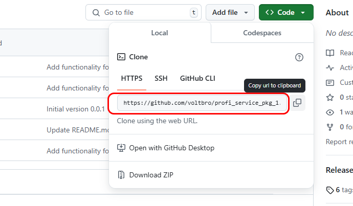{width=690px height=403px}

В терминале внутри робота заходим в \~/catkin_ws/src:

```bash
cd ~/catkin_ws/src
```

клонируем репозиторий:

```bash
git clone <ссылка которую скопировали из гитхаба>
```

Терминал сообщит об успешном копировании:

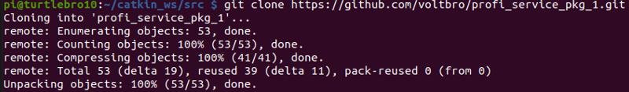{width=800px height=118px}

Заходим в папку, которую склонировали:

```bash
cd profi_service_pkg_1
```

Теперь обновляем до последней версии командой git pull:

```bash
git pull origin master
```

Примерный вывод (если было, что обновлять):

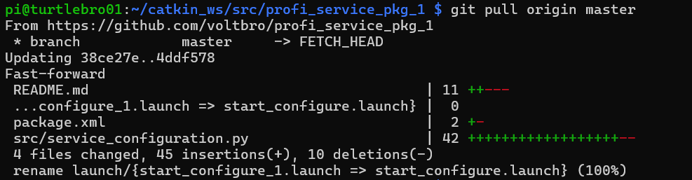{width=987px height=257px}

Примерный вывод (если нечего было обновлять):

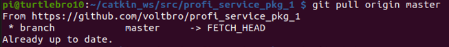{width=653px height=69px}

:::note 

**ВАЖНО!** Все нужные команды, кроме git pull вам запоминать не обязательно. Вся информация, которая написана тут, по установке и запуску пакета, написана в описании репозитория (<https://github.com/voltbro/profi_service_pkg_1>). Эта ссылка будет доступна вам на чемпионате. Просто помните, что вы можете всегда прочитать инфу там

:::

Теперь перед запуском пакета его надо собрать (скомпилировать). Для этого нужно вернуться в директорию catkin_ws (директория со всеми рос пакетами):

```bash
cd ~/catkin_ws/
```

Собираем пакет командой `catkin_make --pkg <название пакета>`:

```bash
catkin_make --pkg profi_service_pkg_1
```

Компиляция займет какое-то время, если не вылезло ошибок (красные строки) и появилось примерно такое в конце вывода, то пакет скомпилирован:

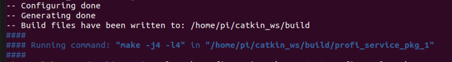{width=772px height=107px}

После этого его можно запустить с помощью roslaunch:

```bash
roslaunch profi_service_pkg_1 start_configure.launch
```

:::note 

**если появилась ошибка ModuleNotFoundError: No module named 'tqdm'**

Пакет не запускается, потому что в питоне не хватает модуля tqdm. Соответственно, его нужно установить:

```
pip3 install tqdm
```

После этого снова выполните запуск пакета:

```
roslaunch profi_service_pkg_1 start_configure.launch
```

:::

Если все ок, то пакет запустится и сконфигурирует нужную вам checksum:

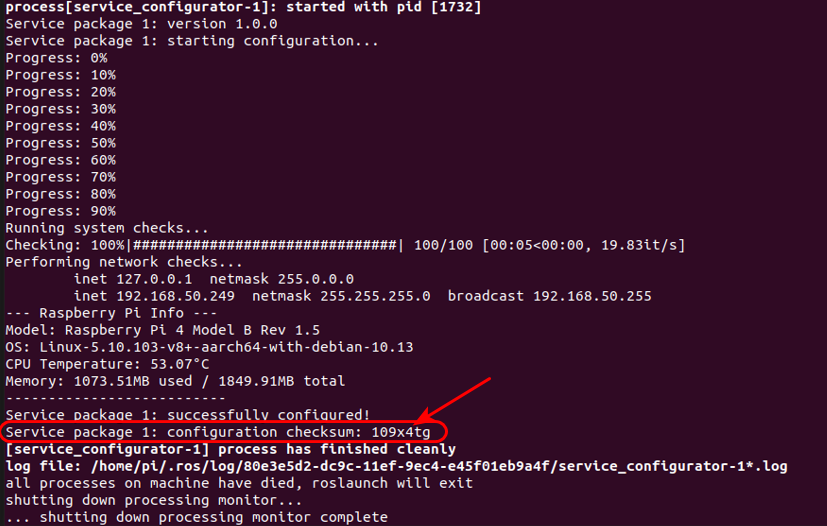{width=827px height=526px}

## ***Б2. Откат версии сервисного пакета***

:::quote 

**В задании написано:**

Во время подготовки к сдаче задания необходимо:

1. Получить список всех коммитов пакета **profi_service_pkg_2**;

2. Откатить пакета **profi_service_pkg_2** к версии **1\.6.3**;

3. Получить параметр конфигурации (configuration checksum), используя launch-файл сервисного пакета.

:::

В целом, действия аналогичны Б1, **но теперь работаем с пакетом service_pkg_2**

1. Заходим в робота

2. Клонируем репозиторий (**вторая** ссылка из задания):

Копируем ссылку на репозиторий из github:

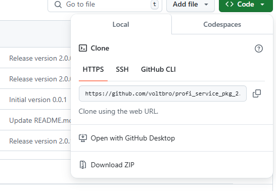{width=546px height=378px}

В терминале внутри робота заходим в \~/catkin_ws/src:

```bash
cd ~/catkin_ws/src
```

клонируем репозиторий:

```bash
git clone <ссылка которую скопировали из гитхаба>
```

Заходим в папку, которую склонировали:

```bash
cd profi_service_pkg_2
```

Теперь нам нужно не обновить пакет, а вернуться к одной из предыдущий версий (а конкретно к версии 1.63 - это написано в задании). Чтобы найти коммит с нужной версией, выполняем `git log` или `git log --oneline`:

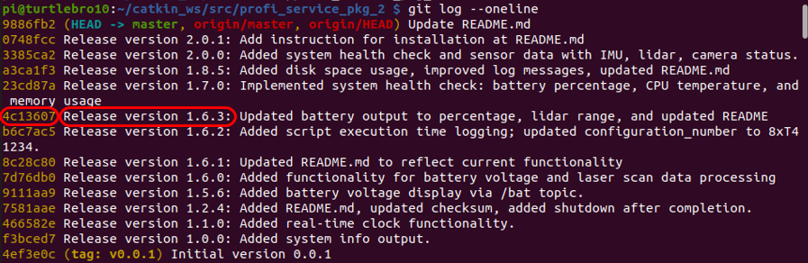{width=897px height=292px}

Копируем хеш-номер коммита (первые 7 символов) и выполняем переход к этой версии с помощью git checkout:

```bash
git checkout <номер коммита>
```

Если все ок, видим вывод:

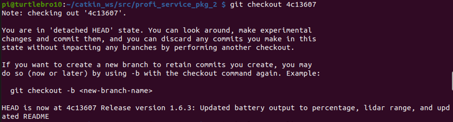{width=894px height=241px}

Теперь мы в этой версии. Проверим, снова выведя лог гита: `git log --oneline`

{width=895px height=208px}

Версию откатили, теперь делаем то же, что и в прошлом задании Б1 - компилируем пакет и запускаем (пользуемся описанием на гите к пакету <https://github.com/voltbro/profi_service_pkg_2>

Перейдите в рабочую директорию вашего ROS-проекта:

```bash
cd ~/catkin_ws
```

Скомпилируйте пакет:

```bash
catkin_make
```

Запустите файл конфигурации:

[highlight:light-pink]**ВНИМАНИЕ!**[/highlight] сейчас в инструкции к пакету в гите написано: `roslaunch profi_service_pkg_2 start_configure.launch`

а файл в пакете называется `start_configure_2.launch (двойка в конце)`

**так вышло, потому что в гите мы видим инструкцию к свежей версии, а пакет-то мы откатили на одну из предыдущих!**

то есть выполняем:

```
roslaunch profi_service_pkg_2 start_configure_2.launch
```

Если launch файлы не срабатывают в любой части задания, вы можете проверить, есть ли такой файл (мб ошибка в названии) перейдя в директорию пакета (`cd ~/catkin_ws/src/<название пакета>/launch`) и выполнив там `ls -ahl.` Вы увидите список доступных файлов.

Еще один способ (это если мы **меняем версию пакета**) - это зайди в директорию пакета и вывести содержимое файла readme в терминал (`cat README.md`). Там вы увидите инструкцию по запуску именно вашей версии пакета

В любом случае, когда вы успешно выполните запуск, получите чексумму:

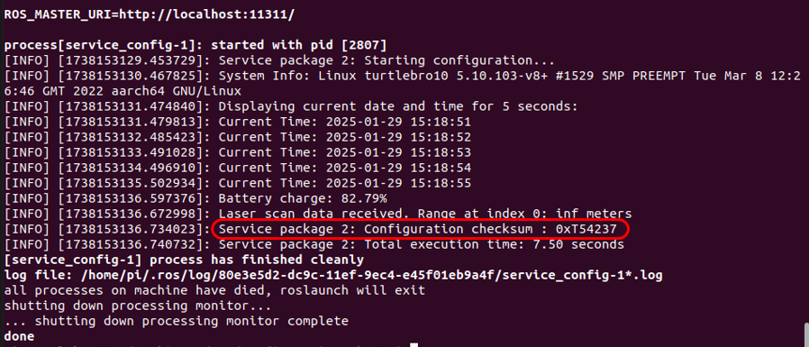{width=898px height=385px}


## **Б3 вар1. Сервисная работа с bag файлами робота**

:::quote 

**В задании написано:**

В ходе ежедневного осмотра производственного помещения робот-инспектор обнаружил превышение регламентной температуры на нескольких производственных станках. После обнаружения неисправностей, робот отправил bag файл с последним циклом обследования территории. Необходимо проанализировать присланный bag файл и указать на плане следующую информацию:

1. Точное месторасположение неисправных приборов (координаты и области на карте);

2. Зафиксированную температуру на неисправных приборах.

Комплектация робота-инспектора:

-  Робот TurtleBro;

-  Комплектом расширения для сборки полезной нагрузки "Робот-инспектор": тепловизор AMG88хх 8x8 Thermal Camera Sensor, сигнальная лампа;

-  Дополнительное программное обеспечение: мета-пакет [turtlebro_ex](https://github.com/voltbro/turtlebro_extra/)

:::

**Суть задания:** расшифровать bag файл, который вам предоставят. Этот файл записан на каком-то другом роботе, на котором еще стоял тепловизор. По расшифрованным данным вам надо отметить на картинке (она тоже будет приложена к вашему заданию) положение перегретых устройств (отметить, указать точные координаты и температуру). Картинка для работы выглядит так:

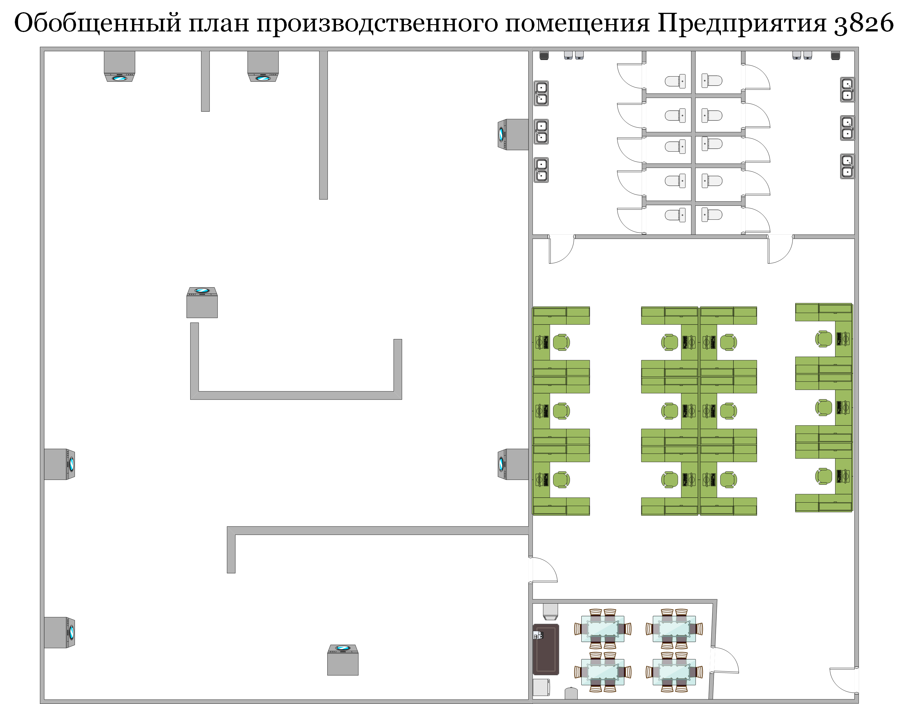{width=3116px height=2419px}

Примерно так должен выглядеть ваш результат:

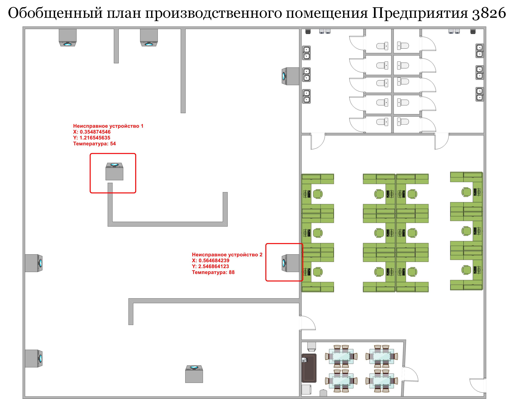{width=3116px height=2419px}

Добавить надписи на картинку можно в любом графическом редакторе, который вы найдете на нотубуке (например, встроенный GIMP)

**Работа выполняется на ноутбуке (не в роботе)**,

**Сейчас у вас скорее всего в файле bashrc в ноутбуке прописан ROS MASTER URI = ip робота. Вам нужно зайти в bashrc на ноутбуке (**`nano ~/.bashrc`**) и заменить ROS MASTER URI на ip адрес ноутбука.**

1. Чтобы мы могли на ноутбуке запустить bag файл, который был записан на роботе, нам нужно установить на ноутбуке пакет turtlebro_extra. Устанавливать будем в директорию catkin_ws/src. Переходим в нее:

```bash
cd ~/catkin_ws/src
```

выполняем клонирование файлов пакета turtlebro extra с гита на ноутбук (ссылка на пакет у вас будет в задании, или легко можно найти в гугле по запросу turtlebro extra):

```bash
git clone https://github.com/voltbro/turtlebro_extra
```

после копирования мы окажемся в \~/catkin_ws/src/turtlebro_extra. выходим обратно в папку catkin_ws:

```bash
cd ..
```

компилируем все:

```bash
catkin_make
```

ИЛИ только пакет: `catkin_make --pkg=turtlebro_extra`

1. ноутбук готов к работе. на нем нужно запустить ros ядро (на роботе мы это не делаем, потому что рос запускается сразу вместе с роботом)

```bash
roscore
```

окно терминала с сервером ROS не закрываем (окно №1)!

1)В терминале переходим в папку, где лежит ваш файл .bag (`cd <адрес папки>`)

1. Выполняем команду `rosbag play <название bag файла>`:

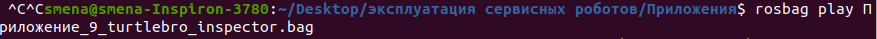{width=877px height=39px}

Получаем вывод:

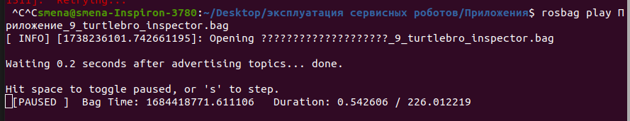{width=889px height=171px}

1. Файл сразу начнет проигрываться. **Нажимаем пробел**, чтобы поставить на паузу. Окно не закрываем (окно №2)

2. Открываем **новое** окно терминала (окно №3) (можно просто вкладку), в нем запускаем `rviz`:

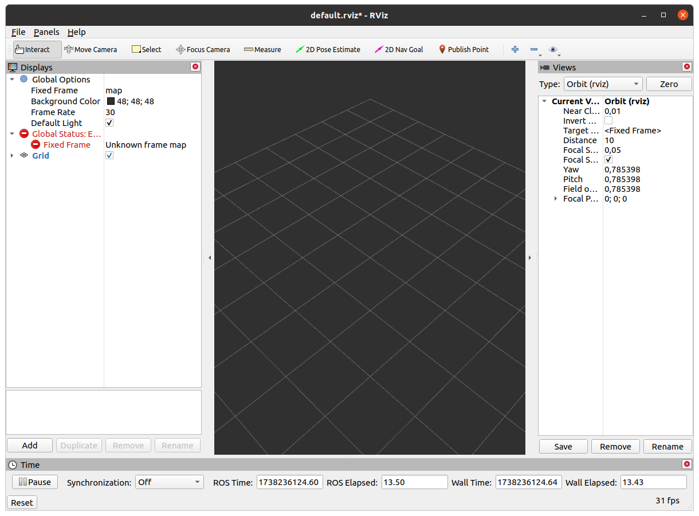{width=1220px height=901px}

В rviz через add добавляем:

-  by topic -> map (чтобы видеть карту)

-  by topic -> PoseWithCovariance (чтобы видеть направление движения)

-  by topic -> /move_base / local_costmap / footprint / Polygon (чтобы видеть самого робота)

1. Открываем еще одно окно терминала (окно №4) (В ОТДЕЛЬНОМ ОКНЕ - НЕ ВКЛАДКУ). В нем нам нужно будет просмотреть показания с тепловизора. Они публикуются в топик /amg88xx_pixels, поэтому включаем прослушивание этого топика:

```bash
rostopic echo /amg88xx_pixels
```

(ничего не будет происходить, потому что проигрывание файла пока на паузе)

1. Открываем еще одно окно терминала (четвертое) (В ОТДЕЛЬНОМ ОКНЕ - НЕ ВКЛАДКУ). В нем нам нужно будет просмотреть координаты робота. Они публикуются в топик /odom_pose2d (в другие тоже, но в этом удобнее), поэтому включаем прослушивание этого топика:

```bash
rostopic echo /odom
```

(ничего не будет происходить, потому что проигрывание файла пока на паузе)

1. Удобно располагаем 3 окна: rviz, терминал с данными тепловизора, терминал с координатами. Затем открываем вкладку, в которой на паузе стоит воспроизведение bag файла и нажатием на пробел снимаем с паузы:

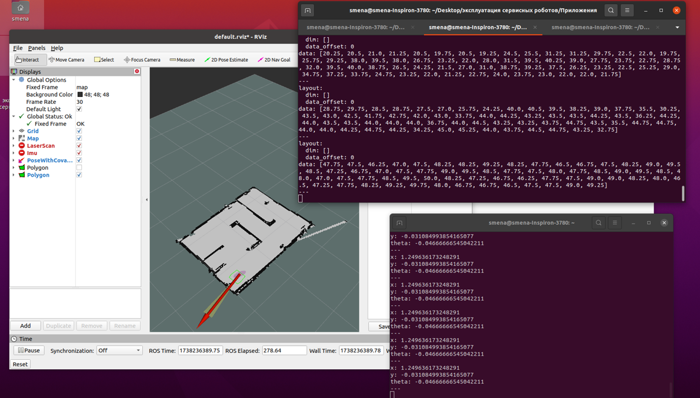{width=1190px height=678px}

Теперь следим за движением робота на карте и за показаниями тепловизора. когда увидите на тепловизоре числа 45 и выше - ставьте на паузу снова (нужно открыть окно терминала с проигрывателем bag файла) и записывайте координаты, температуру, и где на карте был этот прибор.

Всего 2 неисправных прибора. Когда оба найдены, переносите данные на картинку.

Готово!

[highlight:light-pink]**Альтернативный вариант задания Б3:**[/highlight]

## Б3 вар2. Сервисная работа с логами оборудования

Архив с логами для тестирования работы скриптов: <https://disk.yandex.ru/d/dhwIy0v5JSKUAg>

:::quote 

В задании написано:

Необходимо написать скрипты/программы (один скрипт/программа на одну задачу) для управления логами, которые будут выполнять следующие задачи:

1. Используя лог файлы из директории 088820f4-060a-11ee-b33d-dca632e68beb посчитать сколько раз робот выполнил полный цикл патрулирования. Вывод скрипта/программы должен показать конкретное число;

-  Запуск скрипта/программы из домашней директории;

-  Возможность указать в коде скрипта/программы путь до анализируемого лог-файла.

:::

### Часть 1. Посчитать количество полных циклов патрулирования

В указанной директории два файла: roslaunch-turtlebro12-2287.log и turtlebro-patrol-3.log. Сначала разберемся, какой файл нам будет нужен. Патрулирование - посещение каких-то точек по кругу.

Уже по названию можно догадаться, что roslaunch-turtlebro12-2287.log - это какие-то сервисные логи, связанные с запуском пакета. Там нет никакой информации, которая могла бы помочь нам распознать начало и окончание циклов патрулирования.

А если посмотрим в сордержание файла turtlebro-patrol-3.log, то увидим сообщения о достижении точек:

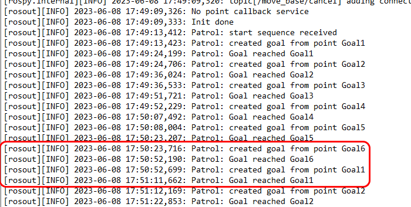{width=700px height=353px}

Видим, что всего точек 6 от Gola1 до Goal6. И после каждой точки 6 робот снова едет в точку 1. Логично будет предположить, что достижение точки 6 - это и есть завершение круга (цикла патрулирования). Значит, нам нужно написать простой питон скрипт, который будет:

1. загружать файл по его адресу на компе

2. находить все сообщения об успешном достижении точки 6 и считать их кол-во

3. выводить это значение в терминал

Это очень «топорный» способ. Например, в задании написано «полных циклов патрулирования». Значит, если мы хотим сделать все идеально, то нам нужно не просто считать количество достиженгий точки 6, но и убеждаться, что круг был полный (перед этим были все точки от 1 до 5) и т.д. Но в данном конкретном случае мы можем пробежаться глазами по файлу и убедиться в этом вручную (все круги полные, «подвохов» нет). Тестироваться при проверке скрипт будет **на том же самом файле** (это, однако, не значит, что вы можете просто написать файл из одной строчки типа `print(«7»)`, так как код будут смотреть).

Создаем пустой питон файл в домашней директории ноутбука в VS Code.

Итак. Первое. Открываем файл с логом. Для этого создаем переменную (например file) и она равна функции `open(здесь в кавычках указывается путь к файлу с логом включая название файла)`:

```python
file = open("путь к файлу")           #открываем файл. python видит его как массив строк
```

Команда open считывает текстовый файл как массив построчно. то есть внутри переменной file у нас будет лежать массив примерно такого содержания:

```python
["[rospy.client][INFO] 2023-06-08 17:49:08,169: init_node, name[/turtlebro_patrol], pid[2304]",
 "[xmlrpc][INFO] 2023-06-08 17:49:08,171: XML-RPC server binding to 0.0.0.0:0",
"[xmlrpc][INFO] 2023-06-08 17:49:08,173: Started XML-RPC server [http://192.168.1.76:42015/
]",
… и т.д.]
```

Так же создаем переменную counter изначально равную 0. В нее будем прибавлять +1 за каждый законченный цикл патрулирования

```python
counter = 0                           #нужно посчитать циклы, поэтому создаем счетчик (изначально = 0)
```

Далее нам нужно сделать следующее: в каждой строке файла (то есть в каждом элементе массива file) проверить наличие текста например «Goal reached Goal6». Если такой текст есть, то к счетчику прибавить +1. Сделаем это с помощью цикла for:

```python
for line in file:                     # для каждой строки в файле
    if('Goal reached Goal6' in line): #если в строке есть нужный текст
        counter = counter+1           # то прибавить к счетчику +1
```

В конце нужно просто вывести значение переменной counter:

```python
print(counter)                        #в конце вывести счетчик
```

Итоговый код:

```python
file = open("путь к файлу")           #открываем файл. python видит его как массив строк
counter = 0                           #нужно посчитать циклы, поэтому создаем счетчик (изначально = 0)
for line in file:                     # для каждой строки в файле
    if('Goal reached Goal6' in line): #если в строке есть нужный текст
        counter = counter+1           # то прибавить к счетчику +1
print(counter)                        #в конце вывести счетчик
```

Готово. Убедитесь, что указали правильный путь к файлу с логом, а так же сохранили свой питон код в домашней директории.

### Часть 2. Посчитать количество полных циклов патрулирования

:::quote 

В задании написано:

Используя лог файлы из директории 25c90b8e-b1d6-11ed-a125-e45f0157ab9f необходимо составить текстовый файл с табличными данными, где:

1. в первом столбце будет указан номер картины;

2. в втором столбце будет указан номер aruco-маркера, который соответствует этой картине;

3. в третьем столбце будет указано название картины и автор;

4. не должно быть одинаковых строчек.

-  Запуск скрипта/программы из домашней директории;

-  Возможность указать в коде скрипта/программы путь до анализируемого лог-файла.

:::

Сначала посмотрим на доступные файлы:

-  **Нужные файлы:**

   1. `speech_service-3.log` - содержит информацию о картинах:

      -  `Start speech: Картина - Последний день Помпеи. Автор - Карл Павлович Брюллов`

      -  Здесь есть название картины и автор

   2. `aruco_detect_server-1.log` - содержит информацию о маркерах:

      -  `ArucoService: Have marker result: 18`

      -  Здесь есть ID aruco-маркеров

-  **Не нужные файлы:**

   1. `excursion_point_service-2.log` - содержит общую информацию о запуске сервиса

   2. `fake_move_base-4.log` - содержит информацию о навигации

   3. `roslaunch-turtlebro12-6924.log` - содержит информацию о запуске ROS-системы

   4. `turtlebro_patrol-5.log` - содержит информацию о патрулировании (если бы мы писали универсальный код, то отсюда стоило бы брать номера картин. но в нашем случае все картины встречаются по порядку)

Итак, работаем с файлами `speech_service-3.log` для названий-авторов и `aruco_detect_server-1.log` для номеров маркеров.

В начале кода открываем оба файла. В ходе подготовки этого мануала я столкнулась с тем, что в файлах может слететь кодировка, из-за этого вместо букв на рус. и англ. появляются при выводе в таблице рандомные символы. Поэтому при чтении файлов указываем кодировку utf-8 (в прошлой задаче это не требовалось, потому что мы не выводили текст, только число):

```python
# Открываем файлы, кодировка в конце указывается, чтобы не было ошибок
log1 = open('aruco_detect_server-1.log', encoding='utf-8')
log2 = open('speech_service-3.log', encoding='utf-8')
```

Далее создаем пустой массив markers и в него записываем все номера маркеров, которые встречаются в файле log1:

```python
# Считываем маркеры из файла log1
markers = []
for line in log1:
    if 'Have marker result:' in line: # Если в строке есть "Have marker result:"
        markers.append(line.split()[-1]) # берем последний символ строки-это номер маркера, и добавляем его в массив
```

Далее аналогично с картинами - названия и авторы находятся в файле log2:

```python
# Считываем картины из файла log2
paintings = []
for line in log2:
    if 'Start speech:' in line: # Если в строке есть "Start speech:"
        paintings.append(line.split('Start speech:')[1].strip()) # берем текст после "Start speech:"-это название картины, и добавляем его в массив
```

Вывести все нужно в виде таблицы, примерно так:

```
№ картины       № маркера       Название картины и автор
Painting 1      18      		Картина - Последний день Помпеи. Автор - Карл Павлович Брюллов
Painting 2      16      		Картина - Ночной дозор. Автор - Рембрандт
```

Очевидный способ - таблица = массив, одна строка в таблице = один элемент в массиве. Так же нужно учесть, что робот делает несколько кругов по картинной галерее, то есть в логах каждая картина встречается несколько раз, а в итоговой таблице не должно быть повторов. Итого: подготавливаем пустой массив для списка «уникальных» картин и второй массив для «уникальных» маркеров. И так же счетчик картин (потому что нужно выводить номер картины в первом столбце), счет с 1:

```python
# Создаем таблицу
seen_paintings = []  # массив для уникальных названий картин (т.к. каждая картина встречается несколько раз)
seen_markers = []    # массив для уникальных маркеров
num = 1              # номера картин начинаются с 1

table_lines = [] # создаем массив для строк будущей "таблицы"
table_lines.append('№ картины\t№ маркера\tНазвание картины и автор') # добавляем шапку таблицы, \t нужен для форматирования для красоты
```

Теперь нужно пройтись по массивам картин и маркеров, убрать повторы и уникальные номера добавить в строки для таблицы. Делаем это в цикле for. Смысл кода подробно расписан в комментариях:

```python
for i in range(len(paintings)): # теперь нужно создать столько строк в таблицу сколько было картин (len(paintings))
    painting = paintings[i] # извлекаем название картины
    marker = markers[i]     # извлекаем номер маркера
    
    # но так как картины могут повторяться, нужно проверить уникальность
    if painting not in seen_paintings and marker not in seen_markers: # если такого названия или маркера еще не было в соотв. массивах
        seen_paintings.append(painting) # добавляем название в соотв. массив
        seen_markers.append(marker)     # добавляем маркер в соотв. массив
        
        # создаем отформатированную строку для таблицы
        line = f'Painting {num}\t{marker}\t{painting}' # /t это аналог tab, чтобы все выглядело как таблица
        table_lines.append(line) # добавляем строку в массив таблицы
        num += 1 # увеличиваем номер картины
```

Наконец, сохраняем текстовый файл с полученной таблицей (по зпдпнию нужно именно сохранит ьв файл, а не вывести в терминал):

```python
# Сохраняем в файл
# 1. Открываем файл для записи
#    with open(файл) as название_переменной значит "открыть файл и дальше в коде его именовать как название_переменной"
#    'w' означает write (запись) - создаем новый файл или перезаписываем старый
#    encoding='utf-8' - чтобы русские буквы сохранились правильно
#    as f - даем файлу короткое имя 'f', чтобы было удобнее к нему обращаться
with open('paintings_table.txt', 'w', encoding='utf-8') as f:
    
    # 2. Проходим по всем строкам, которые мы подготовили
    for line in table_lines:
        
        # 3. Пишем строку в файл
        #    f.write(...) - команда "запиши в файл"
        #    line + '\n' - берем строку и добавляем в конец символ перехода на новую строку
        f.write(line + '\n')
```

Итоговый код (в конце добавила еще пару строчек после сохранения для вывода в терминал, но это не обязательно):

```python

# Открываем файлы, кодировка в конце указывается, чтобы не было ошибок
log1 = open('aruco_detect_server-1.log', encoding='utf-8')
log2 = open('speech_service-3.log', encoding='utf-8')

# Считываем маркеры из файла log1
markers = []
for line in log1:
    if 'Have marker result:' in line: # Если в строке есть "Have marker result:"
        markers.append(line.split()[-1]) # берем последний символ строки-это номер маркера, и добавляем его в массив

# Считываем картины из файла log2
paintings = []
for line in log2:
    if 'Start speech:' in line: # Если в строке есть "Start speech:"
        paintings.append(line.split('Start speech:')[1].strip()) # берем текст после "Start speech:"-это название картины, и добавляем его в массив

# Создаем таблицу
seen_paintings = []  # массив для уникальных названий картин (т.к. каждая картина встречается несколько раз)
seen_markers = []    # массив для уникальных маркеров
num = 1              # номера картин начинаются с 1

table_lines = [] # создаем массив для строк будущей "таблицы"
table_lines.append('№ картины\t№ маркера\tНазвание картины и автор') # добавляем шапку таблицы

for i in range(len(paintings)): # теперь нужно создать столько строк в таблицу сколько было картин (len(paintings))
    painting = paintings[i] # извлекаем название картины
    marker = markers[i]     # извлекаем номер маркера
    
    # но так как картины могут повторяться, нужно проверить уникальность
    if painting not in seen_paintings and marker not in seen_markers: # если такого названия или маркера еще не было в соотв. массивах
        seen_paintings.append(painting) # добавляем название в соотв. массив
        seen_markers.append(marker)     # добавляем маркер в соотв. массив
        
        # создаем отформатированную строку для таблицы
        line = f'Painting {num}\t{marker}\t{painting}' # /t это аналог tab, чтобы все выглядело как таблица
        table_lines.append(line) # добавляем строку в массив таблицы
        num += 1 # увеличиваем номер картины

# Сохраняем в файл
# 1. Открываем файл для записи
#    with open(файл) as название_переменной значит "открыть файл и дальше в коде его именовать как название_переменной"
#    'w' означает write (запись) - создаем новый файл или перезаписываем старый
#    encoding='utf-8' - чтобы русские буквы сохранились правильно
#    as f - даем файлу короткое имя 'f', чтобы было удобнее к нему обращаться
with open('paintings_table.txt', 'w', encoding='utf-8') as f:
    
    # 2. Проходим по всем строкам, которые мы подготовили
    for line in table_lines:
        
        # 3. Пишем строку в файл
        #    f.write(...) - команда "запиши в файл"
        #    line + '\n' - берем строку и добавляем в конец символ перехода на новую строку
        f.write(line + '\n')

# Выводим результат (не обязательно)
for line in table_lines:
    print(line)
```