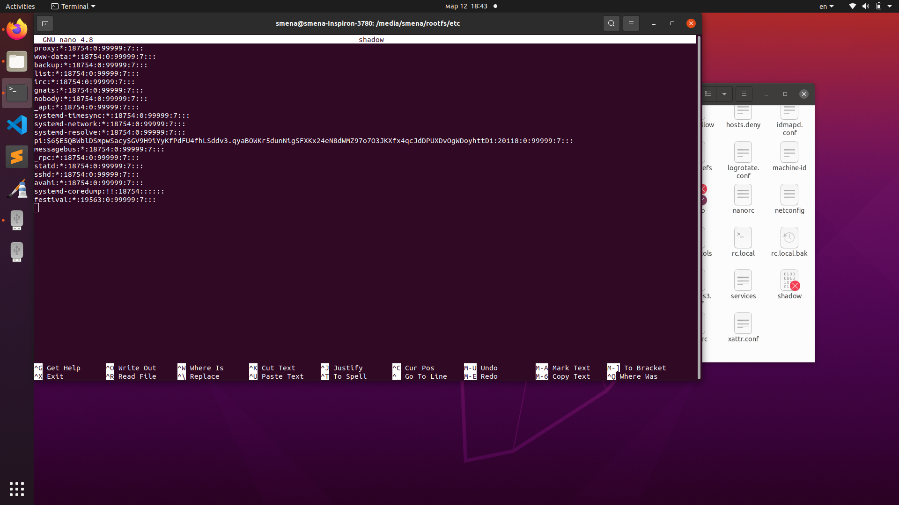
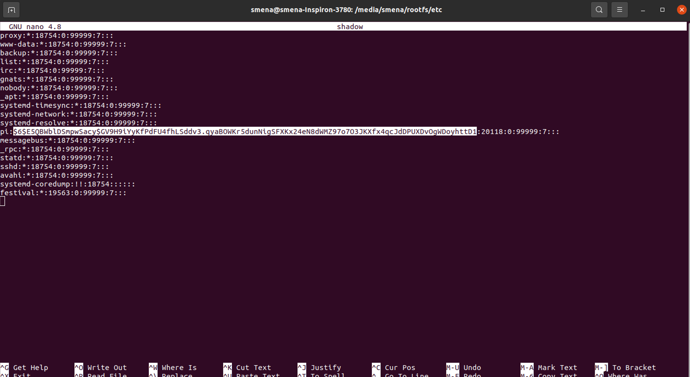
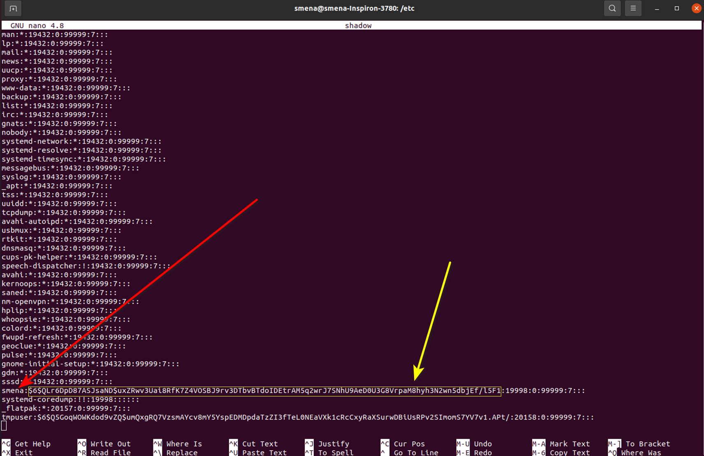
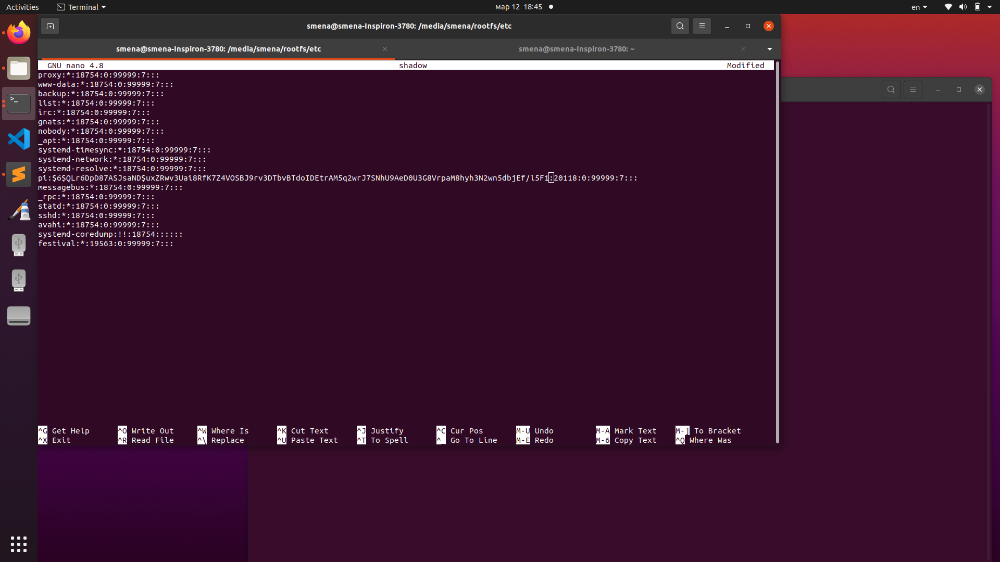
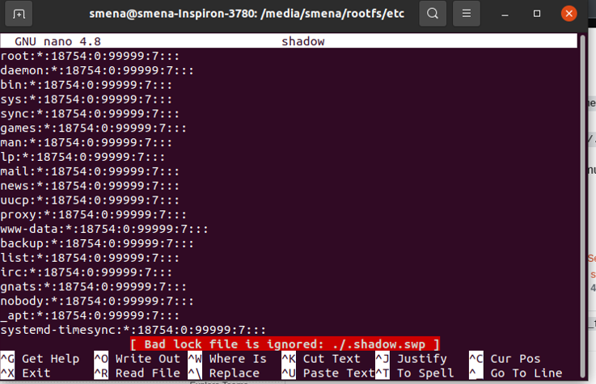
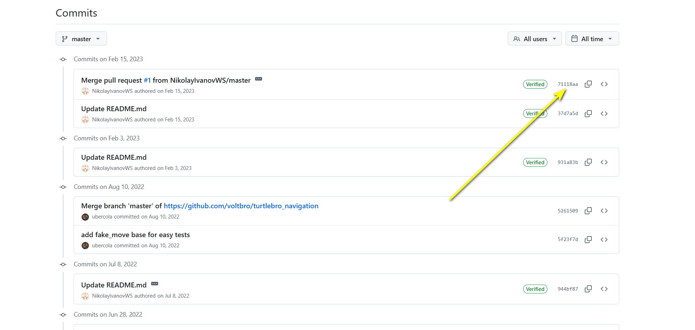

**Всего будет 3 неисправности!**

## **Возможные физические неисправности:**

1. **Отключен кабель от мотора/моторов к плате.**

   1. **Диагностика:** открыть веб-интерфейс, проверить, крутятся ли моторы. Если нет, переходить к решению

   2. **Решение:** подключить обратно кабель\\кабели к моторам

2. **Отключен кабель от камеры к плате**

   1. **Диагностика:** камера на веб-интерфейсе не работает

   2. **Решение:** подключить провод камеры обратно

3. **Отключены провода питания**

   1. **Диагностика:** робот не включается

   2. **Решение:** подключить провода, не перепутав + и -

4. **Отключен type c - usb кабель между синей и зеленой платой**

   1. **Диагностика:** робот включается, но на веб-интерфейс не заходит, через ssh подключиться не получается, через ping не видно ip робота

   2. **Решение:** подключить кабель обратно

5. **Отключен кабель от лидара**

   1. **Диагностика:** зайти в rviz, нажать add, во второй вкладке если нет топика laserScan или он есть, но ничего не выводит - значит лидар отключен

   2. **Решение:** подключить кабель обратно

6. **Лидар выведен из строя (любым способом)**

   1. **Диагностика:** см предыдущий пункт, или визуально (лидар не крутится)

   2. **Решение:** починить лидар (собрать и т.п.)

7. **Отсутствует колесо**

   1. **Диагностика:** нет колеса

   2. **Решение:** прикрутить колесо

8. Отсуствует/откручен энкодер

   1. **Диагностика:** на веб-интерфейсе не меняются координаты или визуально (нет платы энкодера)

   2. **Решение:** прикрутить энкодер обратно

Могут быть и другие - будьте внимательны!

## **Возможные программные неисправности**

**1\.. Изменен пароль (был** `brobro`**, стал - неизвестный)**

Как чинить: через sd карту.

1) Сами по себе пароли нигде не хранятся на sd карте в открытом виде, но они хранятся в виде хэшей. Хэш нельзя расшифровать, но можно заменить на хэш того пароля, который нам известен.

Итак, хэши хранятся в файле /etc/shadow на роботе (раздел rootfs на флешке). Если вы откроете этот файл (в папке etc открыть терминал, далее `sudo nano shadow` чтобы открыть файл), вы увидите много строк и среди них будет строка , начинающаяся с pi:

{width=1920px height=1080px}

строка имеет вид (числа могут быть другими, это просто пример):

```
pi:хэш код:20118:0:99999:7:::
```

собственно, нам нужно заменить хэш код, который находится после pi между 1 и 2 двоеточиями:

{width=1562px height=854px}

хэш код начинается с \$

2) Где же взять хэш код известного нам пароля? В ноутбуке (ведь нам известен пароль от ноутбука - smena)

На ноутбуке пароли лежат в аналогичной папке и файле /etc/shadow. Нужно зайти в эту папку (etc), открыть в ней терминал и открыть файл shadow через `sudo nano shadow`

В этом файле прокрутите вниз, пока не найдете строку, которая начинается со smena (у кого-то это может быть smena-1 smena2 или даже nikitos):

{width=1712px height=1111px}

Скопируйте хэш код пароля от пользователя smena (от 1 двоеточия до 2 двоеточия, НЕ включая сами двоеточия, сам хэш начинается с \$ скорее всего)

3) Затем нужно этот скопированный хэш вставить в файл shadow, который находится на sd карте робота. Важно: не оставляете открытыми окна терминала, не откройте случайно два раза один и тот же файл shadow, это может привести в ошибкам и файл не будет сохраняться. Постарайтесь во время выполнения этих операций держать открытым только 1 окно терминала и за раз выполнять только одно действие. Итак, скопировали хэш из файла shadow на ноуте и вставили в файл shadow на sd карте (вы можете отслеживать, какой где хэш, глядя на последние его символы, и так же желательно этот хэш (который из ноутбука вытащен) скопировать в блокнот, чтобы, если все не получится с первого раза, десять раз не залезать и не искать его):

{width=1920px height=1080px}

На скрине выше в файл shadow вставлен хэш от пароля от ноутбука. Далее сохраните файл shadow (ctrl+O) на sd карте, желательно сделать это несколько раз!!

4) Затем выйдите из редактора nano (ctrl+x), вытащите sd карту НО не вставляйте в робота, снова вставьте ее в ноут и зайдите в файл shadow снова (на sd карте который) и убедитесь, что там стоит именно нужный (новый) хэш. Если все ок, снова сделайте сохранение Ctrl+o и выйдите ctrl+x

5) Вставьте sd карту в робота , дождитесь загрузки и попробуйте войти с паролем "smena". Если вошел, все супер.

6) Если говорит, что пароль неверный, значит, файл не сохранился. значит вам надо снова вставить сд карту в ноут, зайти в файл shadow и проверить, какой там хэш - старый или новый. скорее всего при повторном входе в редактирование файла (sudo nano shadow) у вас появится ошибка примерно такого содержания: "File shadow is being edited (by root with nano 2.4.2, PID xxxx); continue?", то есть система вам скажет, что этот файл уже редактируется в настоящий момент кем-то. вам нужно в такм случае выйти, закрыть все-все окна терминала, вытащить флешку, вставить снова и попробовать еще раз.

7) При появлении ошибки "File shadow is being edited (by root with nano 2.4.2, PID xxxx); continue?", внизу есть опция yes (то есть если вы нажмете y , то у вас откроется редактирование файла и все будет ок), но это может привести к проблемам. лучше все терминалы закрыть и сделать как в п. 6 выше

8) Если вы не послушались того, что написано в п.6 и 7, вы можете встетить такую ошибку:

{width=737px height=475px}

В таком случае нужно выйти из файла, закрыть все терминалы. Затем открыть новый терминал в папке etc на флешке. В этом терминале удалить скрытый файл .shadow.swp:

```
rm ./.shadow.swp
```

Потом попробовать все повторить еще раз

**2\.. Неисправность Ошибка в конфигурации сети:**

-  **Диагностика:** робот не подключается к роутеру полигона -> не работает веб интерфейс, не заходит в робота

-  **Как чинить:** проверьте файл `wpa_supplicant.conf` (/etc/wpa_supplicant/wpa_supplicant.conf)

1. Неисправность **Неверная версия пакета Х**

-  Диагностика: какие-то из функций каких-то пакетов (навигация, доставка, распознавание аруко маркеров и др.) не работают, или пакеты не запускаются вообще

-  Как чинить: ( дальше расскажу на примере turtlebro_navigation):

   -  Зайти на роботе в папку пакета catkin_ws/src/turtlebro_navigation

   -  Выполнить git log --oneline

   -  Посмотреть что вывел

   -  Зайти на гит voltbro в репозиторий пакета turtlebro_navigation и открыть историю коммитов

Если в истории на гите больше коммитов чем у вас в терминале (и номер последнего коммита не совпадает и т.д.)

{width=1973px height=938px}

, то в папке пакета turtlebro_navigation на роботе выполнить `git pull origin master` (или main вместо master) и, когда все загрузится, пререйти в catkin_ws папку и сделать компиляцию командой catkin_make:

```
cd ~/catkin_ws/src/turtlebro_navigation
git pull origin main
catkin_make
```

Еще способ диагностики:

-  Проверить установленную версию пакета:

   ```
   rospack list | grep turtlebro_navigation
   ```

-  Сравнить с актуальной версией на GitHub или документации.

Затем обновить как написано выше

**4\.. Неисправность: Некорректные параметры в launch-файлах**

**Симптомы:**

-  вылезает ошибка типа \[ERROR\] Parameter not found: /cmd_vel при запуске какого-нибудь пакета

**Диагностика:**

-  Проверить файл запуска - зайти в папку пакета (например turtlebro_navigation), в ней внутри в папку launch, вывести содержимое файлов launch (или просто открыть их в vs code):

   ```
   cat navigation.launch (название мб другое)
   ```

-  Проверить, какие параметры загружены:

   ```
   rosparam list
   ```

-  Найти ошибочные или отсутствующие параметры.

**Устранение:**

-  Исправить `launch`\-файл, добавив нужные параметры.

-  Проверить, загружается ли `yaml`\-файл конфигурации, исправить путь.

-  Запустить пакет обычным способом и проверить